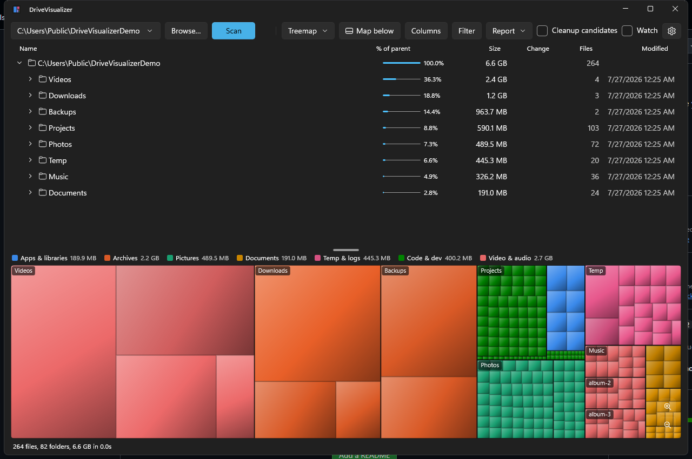
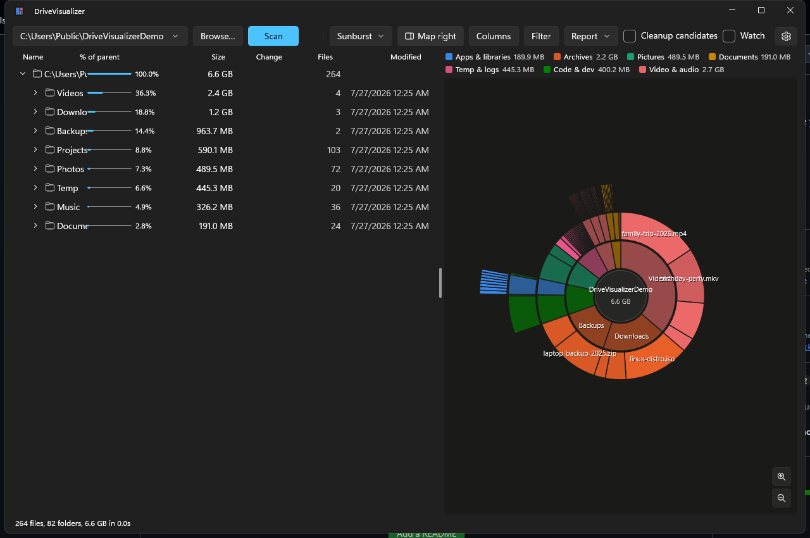

# DriveVisualizer

See what's eating your disk. A fast, WinDirStat-style disk usage analyzer for Windows, built with WinUI 3 and Win2D.



*Screenshots use demo data — your scan shows your own files.*

## Highlights

- **Fast parallel scanning** — raw `FindFirstFileEx` across all cores; a full 1M-file system drive scans in seconds (warm). Junction/symlink-safe (no double counting), long-path-safe, allocated-size aware (compression, sparse files, OneDrive placeholders).
- **Watch it build live** — the directory tree and the map populate *while* the scan runs.
- **Three visualizations** — classic cushion-shaded **treemap**, DaisyDisk-style **sunburst**, and a flame-graph **icicle** view. Folders are tinted by their dominant content; click, hover, and zoom stay in sync with the tree in every mode.
- **Colors that mean something** — nine semantic categories (apps, archives, pictures, documents, temp & logs, code, disk images, media, other) with a legend, a per-category filter, and a colorblind-validated palette.
- **Act on what you find** — right-click to open, reveal in Explorer, copy path, delete to Recycle Bin, delete permanently, or **compress to zip and delete the original**. The model re-aggregates instantly.
- **Cleanup candidates** — one checkbox filters to files that are plausibly safe to review for deletion: temp folders, caches, logs, recycle bin, `node_modules`. Conservative and explainable — no guessing about your documents.
- **What changed?** — every scan auto-saves a baseline; the tree grows a red/green **Change** column vs your previous scan, and one click opens a full diff report (top growers/shrinkers, then/change/now).
- **Size history** — one snapshot per day of use accumulates into a stacked-bar chart of your drive over time, per category.
- **Reports** — self-contained HTML (dark/light aware, print to PDF), snapshot files you can save and compare against later.
- **Stays current** — refresh a single folder from its context menu, or enable **Watch** to auto-refresh folders as files change on disk.



## Install

Grab the latest artifacts from [Actions](../../actions) (built on every push to `main`):

- **`DriveVisualizer-msi`** — traditional installer, self-contained (no runtimes needed). Recommended.
- **`DriveVisualizer-msix-unsigned`** — MSIX package for sideloading; requires signing or developer mode with a trusted cert.

## Build from source

Requirements: .NET 10 SDK, Windows 10 17763+.

```powershell
dotnet build DriveVisualizer.slnx        # build everything
dotnet test DriveVisualizer.Tests        # 27 unit tests
dotnet run --project DriveVisualizer.App # run (packaged, via winapp CLI)
```

To produce installers locally:

```powershell
# MSIX (unsigned)
dotnet build DriveVisualizer.App -c Release -p:Platform=x64 `
  -p:GenerateAppxPackageOnBuild=true -p:AppxPackageDir="$PWD\artifacts\msix\" `
  -p:UapAppxPackageBuildMode=SideloadOnly -p:AppxBundle=Never `
  -p:AppxPackageSigningEnabled=false -p:PublishTrimmed=false

# MSI (WiX 5)
dotnet publish DriveVisualizer.App -c Release -r win-x64 --self-contained `
  -p:WindowsPackageType=None -p:WindowsAppSDKSelfContained=true `
  -p:PublishTrimmed=false -p:PublishReadyToRun=false -o artifacts\publish
dotnet tool install --global wix --version 5.0.2
wix build installer\Package.wxs -d "PublishDir=$PWD\artifacts\publish" -arch x64 -o artifacts\msi\DriveVisualizer.msi
```

## Architecture

| Project | What it is |
|---|---|
| `DriveVisualizer.Core` | UI-free engine: parallel Win32 scanner, file classification, treemap/sunburst/icicle layout math, cleanup heuristics, snapshots & HTML report/history generation. Fully unit-testable. |
| `DriveVisualizer.App` | WinUI 3 app: MVVM (CommunityToolkit), Win2D rendering, shell integration (delete, Explorer, pickers). |
| `DriveVisualizer.Tests` | xUnit suite over Core. |
| `DriveVisualizer.Harness` | Console scanner benchmark. |
| `installer/` | WiX definition for the MSI. |

Design notes live in [PLAN.md](PLAN.md).

## License

[MIT](LICENSE)

## Links

- [github.com/guscatalano/DriveVisualizer](https://github.com/guscatalano/DriveVisualizer)
- [guscatalano.com](https://guscatalano.com)
